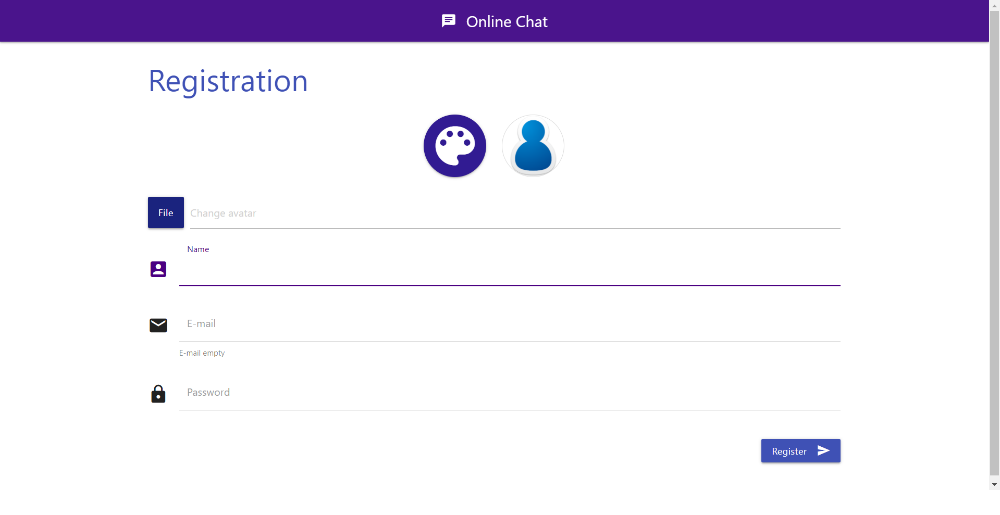
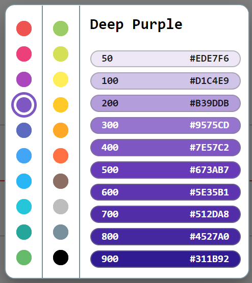
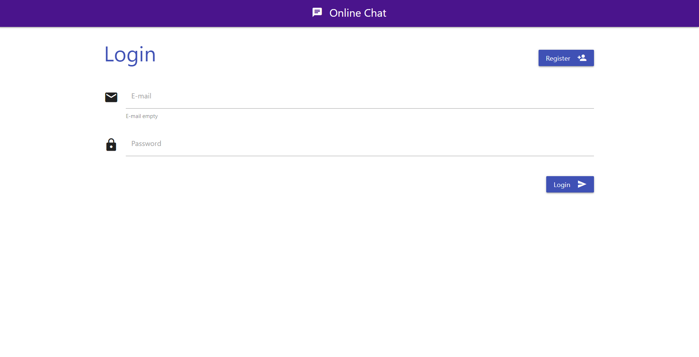
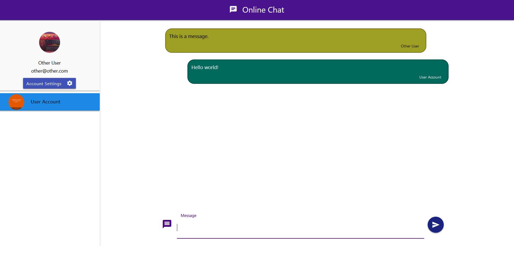
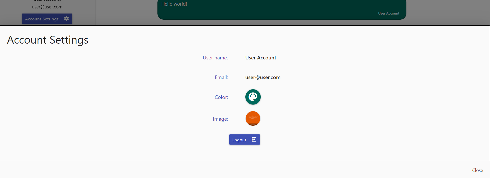

# MaterializeSignalR
Material design chat using SignalR

This is a demonstration of the possibilities provided by the SignalR using .NET 5 ASP.NET Core application.
Besides real time chat application, it provides user registration and logging capabilities, storing information about logins for up to 30 days, and logging from cache.

# Registration

# Color dialog

# Login

# Chat

# Logout

